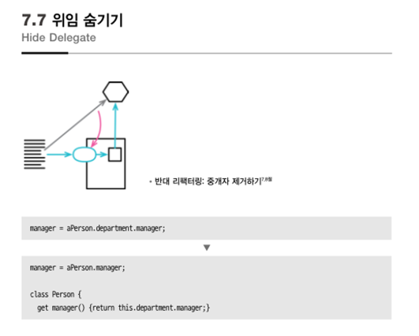
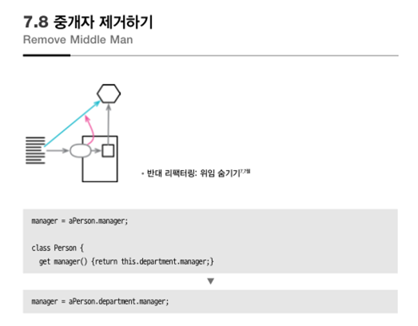
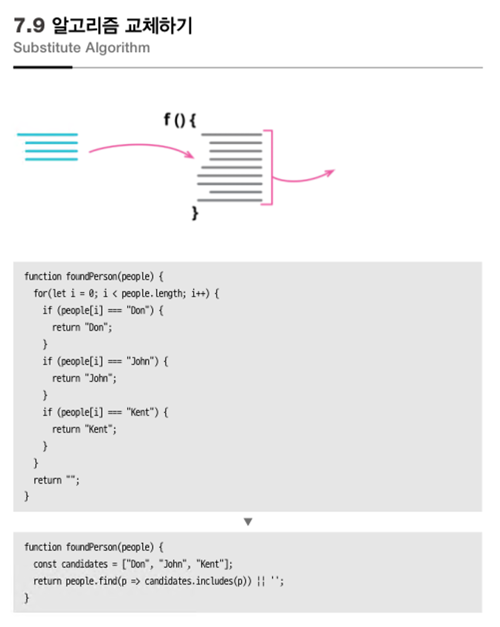

## 7.7 위임 숨기기

1) 위임 메소드를 선언한다.
2) 클라이언트가 위임 메소드를 사용하도록 변경한다.
3) 위임 객체를 얻는 접근자를 제거한다.

---

## 7.8 중개자 제거 하기

위임 숨기기의 반대의 개념

1) 위임 객체를 얻는 게터 만든다.
2) 게터를 통하도록 수정한다.
3) 위임 메소드를 제거한다.

---

## 7.9 알고리즘 교체하기

1) 교체할 코드를 함수 하나에 모은다.
2) 테스트를 준비한다.
3) 교체할 알고리즘을 준비한다.
4) 정적 검사를 수행한다.
5) 테스트를 수행해서 같은면 종료, 같지 않으면 디버깅한다.

이미 잘 만들어진 알고리즘 API 들

[MDN array](https://developer.mozilla.org/ko/docs/Web/JavaScript/Reference/Global_Objects/Array)

[lodash](https://lodash.com/)

[lodash 와 underscore](http://kbs0327.github.io/blog/technology/underscore-lodash/)

[재미있는 성능 비교](https://ui.toast.com/weekly-pick/ko_20190515)
