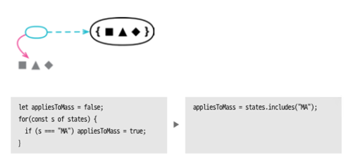
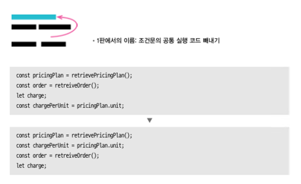

## 8.5 인라인 코드를 함수 호출로 바꾸기

---



함수는 여러 동작을 하나로 묶어 주며 목적을 말해준다.

중복을 줄이며 이해하기 쉬운코드로 변경하는 작업이다.

```javascript
let appliesToMass = false;

for (const s of states) {
    if (s === "MA") appliesToMass = true;
}
``` 

```javascript
const appliesToMass = states.includes("MA");
``` 

라이브러리가 제공하는 함수로 대체가 가능하면 변경 하면 되며 없다면 함수 추출하기를 통하여 새로 만들어 적용한다.

언어의 표준 라이브러리나 프레임워크가 제공하는 API 를 사용하는게 효율적일 가능성이 크니 잘 파악하고 있어야한다.

하지만 외부 라이브러리에 지나치게 의존하면 설계 유연성이 떨어질수 있으므로 신중히 판단하여 사용해야한다.

언어에서 제공하는 표준 라이브러리의 경우 IDE 에서 힌트를 얻어 변경 할 수 있다.

## 8.6 문장 슬라이드 하기

---



관련된 코드끼리 가까이 모여 있으면 이해하기 쉽다.

#### 절차

1) 코드 조각을 이동할 목표 위치를 찾는다. 동작이 달라지는 코드가 있는지 살핀후 아래와 같은 간섭이 있으면 리팩토링을 포기한다.
   1) 코드 조각에서 참조하는 요소를 선언하는 문장 앞으로 이동할 수 없다.
   2) 코드 조각을 참조하는 요소의 뒤로 이동할 수 없다.
   3) 코드 조각에서 참조하는 요소를 수정하는 문장을 건너 뛸 수 없다.
   4) 코드 조각이 수정하는 요소를 참조하는 요소를 건너뛰어 이동할 수 없다.
2) 코드조각을 잘라내어 목표위치에 붙여 넣는다.
3) 테스트한다.

```javascript
const pricingPlan = retrievePricingPlan();
const order = retrieveOrder();
const baseCharge = pricingPlan.base;
let charge;
const chargePerUnit = pricingPlan.unit;
const units = order.units;
let discount;
charge = baseCharge + units * chargePerUnit;
let discountableUnits = Math.max(units - pricingPlan.discountThreshold, 0);
discount = discountableUnits * pricingPlan.discountFactor;
if (order.isRepeat) discount += 20;
charge = charge - discount;
changeOrder(charge);
```

리팩토링

```javascript
const pricingPlan = retrievePricingPlan();
const baseCharge = pricingPlan.base;
let charge;
const chargePerUnit = pricingPlan.unit;
// 위치를 옮김
const order = retrieveOrder();
const units = order.units;
charge = baseCharge + units * chargePerUnit; 
let discountableUnits = Math.max(units - pricingPlan.discountThreshold, 0);
// 위치를 변경
let discount;
discount = discountableUnits * pricingPlan.discountFactor;
if (order.isRepeat) discount += 20; // 코드를 끝으로 슬라이드 할 수 없다.
// charge = baseCharge + units * chargePerUnit; 이동 가능
charge = charge - discount;
changeOrder(charge); // 코드를 슬라이드 할 수 없다.
```

조건문이 있을 때의 슬라이드

```javascript
let result;
if (availableResources.length === 0) {
    result = createResource();
    allocateResources.push(result);
} else {
    result = availableResources.pop();
    allocateResources.push(result);
}
return result;
```

리팩토링

```javascript
let result;
if (availableResources.length === 0) {
    result = createResource();
} else {
    result = availableResources.pop();
}
allocateResources.push(result);
return result;
```