# API 리팩토링

---

## 11.1 질의 함수와 변경 함수 분리 이해하기

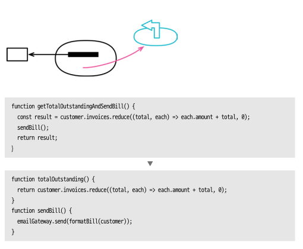

함수는 사이드 이펙트가 없는 함수를 추구해야한다. 이를 위한 방법으로 질의함수(query) - 명령함수(command)를 명확히 구분하는 것이 좋다.

절차
1. 대항함수 복제 및 질의 목적에 맞는 이름 짓기
2. 새 질의 함수에서 부수효과 제거
3. 정적검사 수행
4. 호출부분 찾아 변경 및 테스트
5. 원래 함수 질의 코드 제거
6. 테스트

```javascript
// 악당을 찾으면 이름을 반환하고 경고를 울리는 함수
function alertForMiscreant(people) {
  for (const p of people) {
    if (p === "조커") {
      setOffAlarms();
      return "조커";
    }
    if (p === "사루만") {
      setOffAlarms();
      return "사루만";
    }
  }
  return "";
}
```

1. 함수 복제 및 질의 목적에 맞게 이름 변경
2. 부수효과 제거

```javascript
// 함수명 변경
// 질의 함수에 맞게 이름 짓기
function findMiscreant(people) {
  for (const p of people) {
    if (p === "조커") {
      // 사이드 이펙트 제거
      // setOffAlarms();
      return "조커";
    }
    if (p === "사루만") {
      // 사이드 이펙트 제거
      // setOffAlarms();
      return "사루만";
    }
  }
  return "";
}
```

4. 사용하는 곳 모두 변경

```javascript
const found = alertForMiscreant(people);
// =>
const found = findMiscreant(people);
alertForMiscreant(people);
```

5. 원래 함수에서 질의 코드 변경

```javascript
// 알람만 보내도록 변경
function alertForMiscreant(people) {
  for (const p of people) {
    if (p === "조커") {
      setOffAlarms();
      return;
    }
    if (p === "사루만") {
      setOffAlarms();
      return;
    }
  }
  return;
}
```

하지만 보일러 플레이트처럼 for 문 if 문이 중복되어 사용되어 더 가다듬을 수 있다.

아래는 개인적으로 수정함

```javascript
// 우선 알고리즘 교체하기로 좀 정리
function findMiscreant(people) {
  const filterPeople = ["조커", "사루만"];
  return people.find(p => filterPeople.includes(p)) || "";
  // 솔직히 단순 판별이라면 아래가 나을 듯 합니다. 첫번째 코드랑 같으려고 위 방법으로 했습니다. 
  // return people.some(p => filterfilterPeople.includes(p));
}

function alertForMiscreant(people) {
  // "" 도 falsy
  if (findMiscreant(people)) setOffAlarms();
}
```

---

## 11.2 함수 매개변수화하기

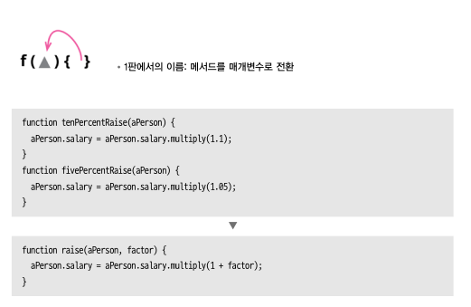

함수 로직이 아주 비슷하고 단지 리터럴 값만 다르면 매개변수로 받아 중복을 처리하자.

절차

1. 비슷한 함수 하나 선택
2. 함수 선언바꾸기로 매개변수 추가
3. 함수 호출부분 전부 변경
4. 테스트
5. 매개변수 값 사용하도록 수정, 테스트
6. 비슷한 함수 찾아 전부 수정, 테스트

```javascript
// 연봉 상승 예시
function tenPercentRaise(aPerson) {
  aPerson.salary = aPerson.salary.multiply(1.1);
}

function fivePercentRaise(aPerson) {
  aPerson.salary = aPerson.salary.multiply(1.05);
}
```

```javascript
function raise(aPerson, factor) {
  aPerson.salary = aPerson.salary.multiply(1 + factor);
}
```

---

## 11.3 플래그 인수 제거하기

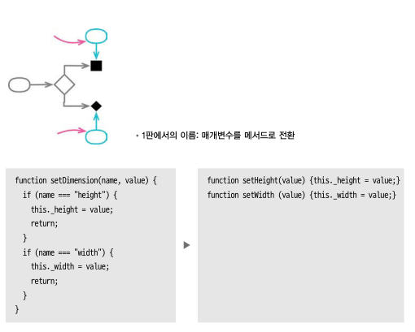

플래그 인수는 함수의 기능을 잘 드러내지 않는다. 읽는이에게 온전한 뜻을 전달하지 못할 수 있다.

예시)

```javascript
// boolean 을 이용하거나
bookConcert(aCustomer, true);

// 열거형을 이용하거나
bookConcert(aCustomer, CustomerType.PREMIUM);

// 문자열 혹은 프로그래밍 언어가 제공하는 타입) 이용하거나
bookConcert(aCustomer, "premium");

// 전부 플래그를 인수를 이용하였다.

// 하나의 기능만 수행하는 명시적인 함수를 제공해보자.
premiumBookConcert(aCustomer);
```

절차

1. 매개변수로 주어지는 값에 각각 명시적 함수를 생성한다.
2. 원래 해당함수를 호출하는 코드에 리터럴값에 대응하는 함수로 수정한다.

```javascript
// 배송일자 계산
// 일부는 이렇게 호출
aShipment.deliveryDate = deliveryDate(anOrder, true);
// 일부는 이렇게 호출
aShipment.deliveryDate = deliveryDate(anOrder, false);
```

`deliveryDate()` 함수는

```javascript
function deliveryDate(anOrder, isRush) {
  if (isRush) {
    let deliveryTime;
    if (["MA", "CT"].includes(anOrder.deliveryState)) deliveryTime = 1;
    else if (["NY", "NH"].includes(anOrder.deliveryState)) deliveryTime = 2;
    else deliveryTime = 3;
    return anOrder.placedOn.plusDays(1 + deliveryTime);
  } else {
    let deliveryTime;
    if (["MA", "CT", "NY"].includes(anOrder.deliveryState)) deliveryTime = 2;
    else if (["ME", "NH"].includes(anOrder.deliveryState)) deliveryTime = 3;
    else deliveryTime = 4;
    return anOrder.placedOn.plusDays(2 + deliveryTime);
  }
}
```

조건문 분해하기(10.1) 을 적용하여

```javascript
function deliveryDate(anOrder, isRush) {
  if (isRush) return rushDeliveryDate(anOrder);
  else return regularDeliveryDate(anOrder);
}

function rushDeliveryDate(anOrder) {
  let deliveryTime;
  if (["MA", "CT"].includes(anOrder.deliveryState)) deliveryTime = 1;
  else if (["NY", "NH"].includes(anOrder.deliveryState)) deliveryTime = 2;
  else deliveryTime = 3;
  return anOrder.placedOn.plusDays(1 + deliveryTime);
}

function regularDeliveryDate(anOrder) {
  let deliveryTime;
  if (["MA", "CT", "NY"].includes(anOrder.deliveryState)) deliveryTime = 2;
  else if (["ME", "NH"].includes(anOrder.deliveryState)) deliveryTime = 3;
  else deliveryTime = 4;
  return anOrder.placedOn.plusDays(2 + deliveryTime);
}
```

그리고 처음 호출했던 부분을 바꿔준다.

```javascript
// 일부는 이렇게 호출
aShipment.deliveryDate = rushDeliveryDate(anOrder);
// 일부는 이렇게 호출
aShipment.deliveryDate = regularDeliveryDate(anOrder);
```

모두 고쳤다면 ~~deliveryDate()~~ 제거

---

## 11.4 객체 통쨰로 넘기기

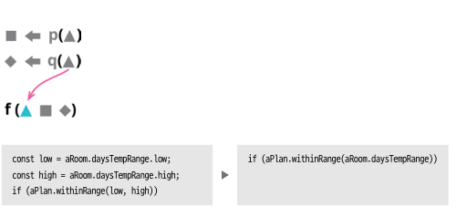

레코드를 통째로 넘기면 변화의 대응하기 쉽고 매개변수 목록을 수정 할 필요가 없으며 매개변수 목록도 짧아져 이해하기 좋다.

또한 함수가 레코드 자체에 의존하는 걸 원치 않을때 특히 레코드와 함수가 다른 모듈의 속할때 사용하면 좋다.

절차

1. 매개변수를 원하는 형태의 빈 함수 생성
2. 새 함수의 본문에서 원래 함수를 호출하도록 매핑
3. 정적 검사
4. 모든 호출자를 새함수로 변경
5. 원래 함수 인라인
6. 새함수 이름을 적절히 수정

```javascript
// 실내온도 모니터링 시스템
// 일일 최저/최고 기온이 계획에 벗어나는지 확인
// 호출자
const low = aRoom.daysTempRange.low;
const high = aRoom.daysTempRange.high;
if (!aPlan.withinRange(low, high))
  alerts.push("방 온도가 지정 범위를 벗어났습니다.");
```

```javascript
// HeatingPlan 클래스
// 지정 범위 온도인지 확인하는 함수
withinRange(bottom, top) {
  return (bottom >= this._temperatureRange.low) && (top <= this._temperatureRange.high);
}
```

리팩토링 적용

```javascript
// HeatingPlan 클래스
// 새롭게 지정 범위 온도인지 확인하는 함수
xxNewWithinRange(aNubmerRange) {
  return this.withinRange(aNubmerRange.low, aNubmerRange.high);
}
```

호출자 수정

```javascript
// 호출자 수정
if (!aPlan.xxNewWithinRange(aRoom.daysTempRange))
  alerts.push("방 온도가 지정 범위를 벗어났습니다.");
```

다시 기존 함수를 대체하도록 수정

```javascript
// HeatingPlan 클래스
xxNewWithinRange(aNubmerRange) {
  return (aNubmerRange.low >= this._temperatureRange.low) && (aNubmerRange.high <= this._temperatureRange.high);
}
```

기존 `withinRange()` 사용하던 곳을 전부 제거하고 임시함수의 이름을 바꾼다.

```javascript
// HeatingPlan 클래스
withinRange(aNubmerRange) {
  return (aNubmerRange.low >= this._temperatureRange.low) && (aNubmerRange.high <= this._temperatureRange.high);
}
```

```javascript
// 호출자
if (!aPlan.withinRange(aRoom.daysTempRange))
  alerts.push("방 온도가 지정 범위를 벗어났습니다.");
```

ide 기능을 활용 해서 바꿉시다. 책에서도 인라인 리팩토링을 지원하는 편집기를 이용하면 쉽게 할수 있다고 소개

---

## 11.5 매개변수를 질의 함수로 바꾸기

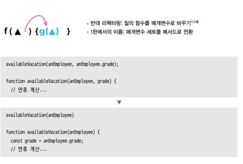

매개 변수 목록은 중복을 피하는것이 좋으며 짧을 수록 이해하기 쉽다.

절차
1. 필요하다면 매개변수 값을 계산하는 코드를 함수로 추출
2. 대상 매개변수로의 참조를 모두 찾아서 매개변수의 값을 만들어주는 표현식을 참조하도록 수정, 테스트
3. 함수 선언 바꾸기 로 매개변수 제거 

```javascript
// Order 클래스
get finalPrice() {
  const basePrice = this.quantity * this.itemPrice;
  let discountLevel;
  if (this.quantity > 100) discountLevel = 2;
  else discountLevel = 1;
  return this.discountedPrice(basePrice, discountLevel);
}

discountedPrice(basePrice, discountLevel) {
  switch (discountLevel) {
    case 1: return basePrice * 0.95;
    case 2: return basePrice * 0.9;
  }
}
```

리팩토링 시작

```javascript
// Order 클래스
get finalPrice() {
  const basePrice = this.quantity * this.itemPrice;
  return this.discountedPrice(basePrice, this.discountLevel);
}

get discountLevel() {
  return this.quantity > 100 ? 2 : 1;
}
```
임시변수를 질의 함수로 바꾸기 를 적용하면 `discountLevel` 반환겂을 매개변수로 전달 필요가 없다.

따라서 매개변수를 제거하며 수정하면 

```javascript
// Order 클래스
discountedPrice(basePrice) {
  switch (this.discountLevel) {
    case 1: return basePrice * 0.95;
    case 2: return basePrice * 0.9;
  }
}

get finalPrice() {
  const basePrice = this.quantity * this.itemPrice;
  return this.discountedPrice(basePrice);
}
```

---

## 11.6 질의 함수를 매개변수로 바꾸기

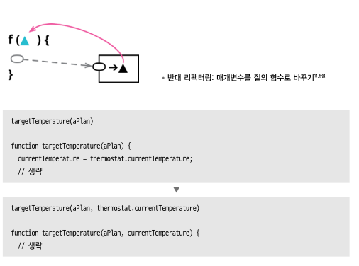

함수 안에서 전역 변수를 참조하거나 제거 하길 원하는 원소를 참조하는 경우 이 래픽토링을 진행한다.

보통은 코드 의존관계를 변경 할때 발생하며 소프트웨어는 변경 되기 때문에 맞는 리팩토링이 아니다.

> 이 저자는 호출자가 단순해지도록 설계하는 걸 선호함

절차
1. 변수 추출하기로 질의 코드를 함수와 분리
2. 함수 본문에서 질의를 호출하지 않는 코드를 별도 함수로 추출
3. 만든 변수를 인라인하여 제거
4. 원래 함수 인라인
5. 새 함수 이름을 원래 이름으로 고침

```javascript
// 실내온도 제어 시스템
// thermostat => 온도 조절기
// HeatingPlan 클래스
get targetTemperature() {
  if (thermostat.selectedTemperature > this._max) return this._max;
  else if (thermostat.selectedTemperature < this._min) return this._min;
  else return thermostat.selectedTemperature;
}
```

```javascript
// 호출자
if (thePlan.targetTemperature > thermostat.currentTemperature) setToHeat();
else if (thePlan.targetTemperature < thermostat.currentTemperature) setToCold();
else setOff();
```

`targetTemperature()` 은 전역 객체 thermostat 의 의존하고 있다.

리팩토링 진행

```javascript
// HeatingPlan 클래스
get targetTemperature(){
  const selectedTemperature = thermostat.selectedTemperature;
  return this.xxNewTargetTemperature(selectedTemperature);
}

// 새로운 함수 생성
xxNewTargetTemperature(selectedTemperature) {
  if (selectedTemperature > this._max) return this._max;
  else if (selectedTemperature < this._min) return this._min;
  else return selectedTemperature;
}
```

변수 인라인 진행

```javascript
// HeatingPlan 클래스
get targetTemperature(){
  // 변수 인라인
  return this.xxNewTargetTemperature(thermostat.selectedTemperature);
}
```

호출자 부분에도 적용

```javascript
// 호출자
if (thePlan.xxNewTargetTemperature(thermostat.selectedTemperature) > thermostat.currentTemperature) setToHeat();
else if (thePlan.xxNewTargetTemperature(thermostat.selectedTemperature) < thermostat.currentTemperature) setToCold();
else setOff();
```

함수명 변경 까지 진행하면


```javascript
// 호출자
if (thePlan.targetTemperature(thermostat.selectedTemperature) > thermostat.currentTemperature) setToHeat();
else if (thePlan.targetTemperature(thermostat.selectedTemperature) < thermostat.currentTemperature) setToCold();
else setOff();
```

```javascript
// HeatingPlan 클래스
get targetTemperature(selectedTemperature) {
  if (selectedTemperature > this._max) return this._max;
  else if (selectedTemperature < this._min) return this._min;
  else return selectedTemperature;
}
```

`HeatingPlan` 클래스는 `thermostat` 라는 온도조절기의 의존만 제거 한 것이 아닌 불변 클래스가 되었다.

`targetTemperature()` 메소드 또한 참조 투명하게 만들어 언제나 같은 인수에 같은 결과를 반환 한다.

---

## 11.7 세터 제거하기

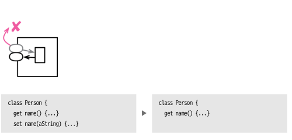

세터 메소드는 필드 수정을 가능하게 한다. 객체 생성후 수정되면 안되는 필드라면 세터를 제거해야한다.

절차
1. 설정해야 할 값이 생성자에서 받지 않는다면 그 값을 받을 매개변수를 생성자에 추가, 다음 생성자 안에서 세터 호출 
2. 생성자 밖에서 세터 호출하는 곳 제거, 생성자 사용하도록 수정, 테스트
3. 세터 메소드 인라인, 필드 불변화
4. 테스트

```javascript
// Person 클래스
get name() {return this._name;}
set name(arg) {this._name = arg;}
get id() {return this._id;}
set id(arg) {this._id = arg};
```

객체 생성 

```javascript
const martin = new Person();
martin.name = "마틴";
martin.id = "1234";
```

당연하게도 ID 는 변경 되면 안된다. id 필드의 세터를 제거하고 생성자로 교체하자.

```javascript
// Person 클래스
constructor(id) {
  this._id = id;
}

get name() {return this._name;}
set name(arg) {this._name = arg;}
get id() {return this._id;}
```

생성자를 사용하여 ID 를 설정하도록 수정

```javascript
const martin = new Person("1234");
martin.name = "마틴";
```

---

## 11.8 생성자를 팩토리 함수로 선언바꾸기

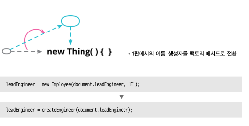

생성자는 매우 특별한 용도의 함수다. 보통 언어의 제약사항으로 사용이 불편 할 수 있다. (서브클래스 인스턴스 반환, 프록시 반환, 일반 함수로 사용 안됨 등)

팩토리함수는 이런 제약이 없으며 더 기본 이름이 아닌 더 적절한 이름으로 대체 할 수 있다.

절차
1. 팩토리 함수를 생성, 본문에서 원래 생성자 호출
2. 생성자 호출 코드 변경
3. 테스트
4. 생성자 가시 범위가 최소가 되도록 제한

```javascript
// 직원 유형을 다루는 예제
// Employee 클래스
constructor(name, typeCode) {
  this._name = name;
  this._typeCode = typeCode;
}

get name() { return this._name; }
get type() { return Employee.legalTypeCodes[this._typeCode]; }

static get legalTypeCodes() {
  return { "E" : "Engineer", "M" : "Manager", "S" : "Salesperson" };
}
```

```javascript
// 호출자
candidate = new Employee(document.name, document.empType);

// 호출자
const engineer = new Employee(document.leadEngineer, 'E');
```

팩토리 함수 만들기

```javascript
function createEmployee(name, typeCode) {
  return new Employee(name, typeCode);
}

// 유형에 맞는 팩토리함수로 생성
function createEngineer(name) {
  return new Employee(name, 'E');
}
```

팩토리 함수로 변경

```javascript
// 호출자
candidate = createEmployee(document.name, document.empType);

// 호출자
const engineer = createEngineer(document.leadEngineer);
```

---

## 11.9 함수를 명령으로 바꾸기

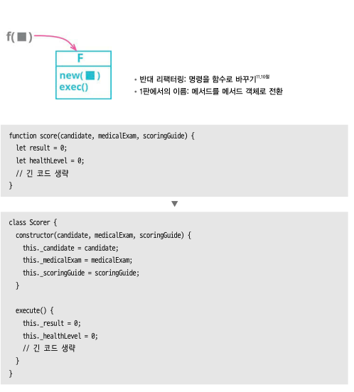

함수를 객체 안으로 캡슐화 하면 명령(command) 라고 한다.

명령은 유연하게 함수를 제어하고 표현 하며 복잡한 함수를 잘게 쪼갤 수 있으며 상속과 훅을 이용해 사용자 맞춤형으로 만들 수도 있다.
명령은 일급 함수의 기능을 대부분 흉내 낼수 있다.

하지만 유연성이 올라가는 만큼 복잡성을 키우게 된다.

> 저자는 명령과 일급함수 중에 선택한다면 일급 함수를 선호한다고 한다.

절차
1. 함수의 기능을 옮길 빈 클래스 생성
2. 빈 클래스로 함수 이동
3. 함수의 인수들 각각은 명령의 필드로 만들어 생성자를 통해 설정할지 선택

```javascript
// 건강보험 어플리케이션에서 사용하는 점수 계산 함수
function score(candidate, medicalExam, scoringGuide) {
  let result = 0;
  let helthLevel = 0;
  let highMedicalRiskFlag = false;
  
  if (medicalExam.isSmoker) {
    helthLevel += 10;
    highMedicalRiskFlag = true;
  }
  let certificationGrade = "regular";
  if (scoringGuide.stateWithLowCertification(candidate.originState)) {
    certificationGrade = "low";
    result -= 5;
  }
  // 비슷한 코드가 한참 이어짐
  result -= Math.max(helthLevel - 5, 0);
  return result;
}
```

1 빈클래스 생성, 2 함수 이동

```javascript
function score(candidate, medicalExam, scoringGuide) {
  return new Scorer().execute(candidate, medicalExam, scoringGuide);
}

class Scorer {
  execute(candidate, medicalExam, scoringGuide) {
    let result = 0;
    let helthLevel = 0;
    let highMedicalRiskFlag = false;

    if (medicalExam.isSmoker) {
      helthLevel += 10;
      highMedicalRiskFlag = true;
    }
    let certificationGrade = "regular";
    if (scoringGuide.stateWithLowCertification(candidate.originState)) {
      certificationGrade = "low";
      result -= 5;
    }
    // 비슷한 코드가 한참 이어짐
    result -= Math.max(helthLevel - 5, 0);
    return result;
  }
}
```

하나씩 인수를 옮기는 작업을 하라고 책에 나오지만 한번에 하겠습니다.

```javascript
function score(candidate, medicalExam, scoringGuide) {
  return new Scorer(candidate, medicalExam, scoringGuide).execute();
}

class Scorer {
  constructor(candidate, medicalExam, scoringGuide) {
    this._candidate = candidate;
    this._medicalExam = medicalExam;
    this._scoringGuide = scoringGuide;
  }
  
  execute() {
    let result = 0;
    let helthLevel = 0;
    let highMedicalRiskFlag = false;

    if (this._medicalExam.isSmoker) {
      helthLevel += 10;
      highMedicalRiskFlag = true;
    }
    let certificationGrade = "regular";
    if (this._scoringGuide.stateWithLowCertification(this._candidate.originState)) {
      certificationGrade = "low";
      result -= 5;
    }
    // 비슷한 코드가 한참 이어짐
    result -= Math.max(helthLevel - 5, 0);
    return result;
  }
}
```

여기까지가 함수를 명령으로 바꾼 것이지만 계산의 복잡한 함수를 변경한것 아니다.
여기서 끝나면 아무런 의미가 없으므로 조금더 진행

```javascript
// 우선 지역 변수를 필드로 변경
class Scorer {
  constructor(candidate, medicalExam, scoringGuide) {
    this._candidate = candidate;
    this._medicalExam = medicalExam;
    this._scoringGuide = scoringGuide;
  }

  execute() {
    this._result = 0;
    this._healthLevel = 0;
    this._highMedicalRiskFlag = false;

    if (this._medicalExam.isSmoker) {
      this._healthLevel += 10;
      this._highMedicalRiskFlag = true;
    }
    this._certificationGrade = "regular";
    if (this._scoringGuide.stateWithLowCertification(this._candidate.originState)) {
      this._certificationGrade = "low";
      this.result -= 5;
    }
    // 비슷한 코드가 한참 이어짐
    this._result -= Math.max(this._healthLevel - 5, 0);
    return this._result;
  }
}
```

이 상태에서는 변수나 유효 범위에 구애 받지 않고 함수 추출하기가 가능하다.

```javascript
class Scorer {
  constructor(candidate, medicalExam, scoringGuide) {
    this._candidate = candidate;
    this._medicalExam = medicalExam;
    this._scoringGuide = scoringGuide;
  }

  execute() {
    this._result = 0;
    this._healthLevel = 0;
    this._highMedicalRiskFlag = false;

    // 함수로 추출
    this.scoreSmoking();  
    this._certificationGrade = "regular";
    if (this._scoringGuide.stateWithLowCertification(this._candidate.originState)) {
      this._certificationGrade = "low";
      this.result -= 5;
    }
    // 비슷한 코드가 한참 이어짐
    this._result -= Math.max(this._healthLevel - 5, 0);
    return this._result;
  }
  
  scoreSmoking() {
    if (this._medicalExam.isSmoker) {
      this._healthLevel += 10;
      this._highMedicalRiskFlag = true;
    }
  }
}
```

계속 객체에서 함수로 쪼개기 가능

---

## 11.10 명령을 함수로 바꾸기

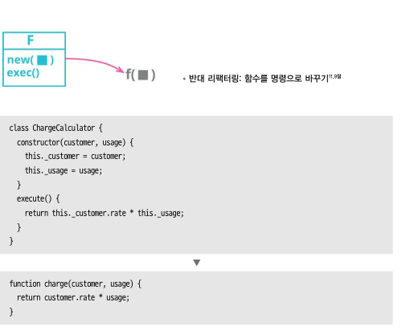

명령은 복잡한 연산을 다룰 때 좋지만 로직이 크게 복잡하지 않다면 명령객체 보다 함수를 쓰는게 낫다.

절차
1. 명령 생성 코드, 실행코드를 함수로 추출
2. 명령의 실행 함수 호출 보조 메소드를 인라인
3. 함수 선언 바꾸기 적용, 매게변수를 실행 메소드로 이동
4. 필드에 댕으하는 매개변수로 수정, 테스트
5. 생성자 호출과 명령 실행 메소드 인라인
6. 테스트
7. 명령 클래스 제거

```javascript
// 간단한 연산
class ChargeCalculator {
  constructor(customer, usage, provider) {
    this._customer = customer;
    this._usage = usage;
    this._provider = provider;
  }
  
  get baseCharge() {
    return this._customer.baseRate * this._usage;
  }
  
  get charge() {
    return this.baseCharge + this._provider.connectionCharge;
  }
}

// 호출자
monthCharge = new ChargeCalculator(customer, usage, provider).charge;
```

위 명령형 클래스는 간단해서 함수로 대체한다.

```javascript
function charge(customer, usage, provider) {
  const baseCharge = customer.baseRate * usage;
  return baseCharge + provider.connectionCharge;
}

monthCharge = charge(customer, usage, provider);
```

연산이 간단하여 훨씬 간단해 졌는데 명령으로 남겨도 크게 문제 되지 않을거 같다.

---

## 11.11 수정된 값 반환하기

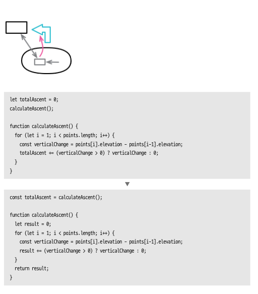

데이터가 수정되는지를 추적하는것은 어렵다.
데이터가 수정됨을 알려주는 방법은 함수로 값을 반환하여 변수에 담아두는 것이다.

절차
1. 호출자가 그 값을 변수에 저장하도록 수정
2. 테스트
3. 피호출 함수에서 반환할 값을 가리키는 새로운 변수 선언
4. 테스트
5. 계산이 선언과 동시에
6. 테스트
7. 피호출 함수의 변수 이름 변경
8. 테스트

```javascript
// GPS 위치 목록으로 다양한 계산 수행한는 코드
let totalAscent = 0;
let totalTime = 0;
let totalDistance = 0;
calculateAscent();
calculateTime();
calculateDistance();

const pace = totalTime / 60 / totalDistance;
```

`calculateAscent()` 이 함수만 리팩토링 할 것이다.

```javascript
function calculateAscent() {
  for (let i = 0; i < points.length; i++) {
    const verticalChange = points[i].elevation - points[i-1].elevation;
    totalAscent += (verticalChange > 0) ? verticalChange : 0;
  }
}
```

애초에 로직을 보지 않으면 `totalAscent` 값이 갱신 된다는 것 조차 알수가 없다.

```javascript
// 5번 선언과 동시에 계산
const totalAscent = calculateAscent();
let totalTime = 0;
let totalDistance = 0;
calculateTime();
calculateDistance();

const pace = totalTime / 60 / totalDistance;

function calculateAscent() {
  // 7 변수 이름이 헷갈리지 않도록 변경
  let result = 0;
  for (let i = 0; i < points.length; i++) {
    const verticalChange = points[i].elevation - points[i-1].elevation;
    result += (verticalChange > 0) ? verticalChange : 0;
  }
  return result;
}
```

마찬가지로 진행한다.

```javascript
const totalAscent = calculateAscent();
let totalTime = calculateTime();
let totalDistance = calculateDistance();

const pace = totalTime / 60 / totalDistance;
```

---

## 11.12 오류 코드를 예외로 바꾸기

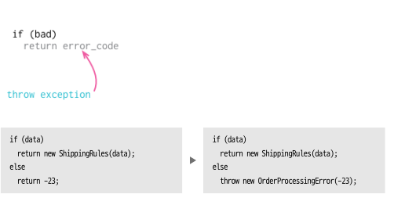

오류코드를 사용하면 사용자가 오류코드를 식별해야하면 일일히 상황에 따라 대처해야하는 코드를 작성해야한다.

예외는를 던지는 코드는 프로그램 종료 코드로 바꿔도 여전히 정상 동작을 할지로 따져 보고 예외를 사용 할지를 정해야한다.

절차
1. 콜스택 상위 예외 처리 핸들러 작성
2. 테스트
3. 오류 코드 대체할 예외 와 그밖의 예외 식별 방법 찾기
4. 정적검사
5. catch 절을 수정하여 적절히 대처 아니면 다시 던지기
6. 테스트
7. 오류 코드 반환하는 곳 예외 던지게 수정
8. 오류 코드 콜스택 위로 전달하는 코드 제거, 테스트

```javascript
// 전역테이블에서 배송지의 배송 규칙 알아내는 코드
function localShippingRules(country) {
  const data = countryData.shippingRules[country];
  if (data) return new ShippingRules(data);
  else return -23;
}

function calculateShippingCosts(anOrder) {
  // 관련 없는 코드
  const shippingRules = localShippingRules(anOrder.country);
  if (shippingRules < 0) return shippingRules; // 오류 전파
  // 더 관련 없는 코드
}

// 최상위
const status = calculateShippingCosts(orderData);
if (status < 0) errorList.push({order: orderData, errorCode: status});
```

리팩토링을 진행하면

```javascript
// 1 try/catch 블럭으로 예외처리 핸들러 구성
let status;
try {
  status = calculateShippingCosts(orderData);
} catch (e) {
  throw e;
}
if (status < 0) errorList.push({order: orderData, errorCode: status});
```

예외 클래스 선언 그리고 적용

```javascript
// 예외 클래스 선언
class OrderProcessingError extends Error {
  constructor(errorCode) {
    super(`주문 처리 오류: ${errorCode}`);
    this.code = errorCode;
  }
  get name() {return "OrderProcessingError";}
}

let status;
try {
  status = calculateShippingCosts(orderData);
} catch (e) {
  if (e instanceof OrderProcessingError)
    errorList.push({order: orderData, errorCode: e.code});
  else 
    throw e;
}
if (status < 0) errorList.push({order: orderData, errorCode: status});
```

오류 코드 대신 예외를 던지도록 수정

```javascript
function localShippingRules(country) {
  const data = countryData.shippingRules[country];
  if (data) return new ShippingRules(data);
  else throw new OrderProcessingError(-23);
}

function calculateShippingCosts(anOrder) {
  // 관련 없는 코드
  const shippingRules = localShippingRules(anOrder.country);
  // 오류전파가 필요 없으므로 제거 => 예외를 던지도록 수정했음
  // if (shippingRules < 0) return shippingRules;
  // 더 관련 없는 코드
}
```

마지막으로 필요없어진 변수를 제거하면

```javascript
try {
  calculateShippingCosts(orderData);
} catch (e) {
  if (e instanceof OrderProcessingError)
    errorList.push({order: orderData, errorCode: e.code});
  else 
    throw e;
}
```

---

## 11.13 예외를 사전확인으로 바꾸기

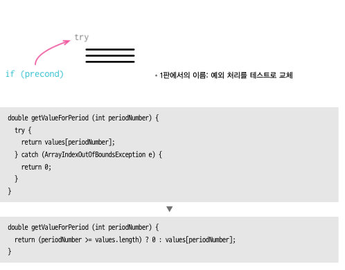

예외는 `뜻밖에 오류` 라는 말 대로 과용 되면 안된다. 정말 예외적으로 동작 할때만 쓰야야 한다. 함수 호출시 조건 을 검사하자.

절차
1. 예외를 유발하는 상황을 검사할 수 있는 조건문 추가, catch 블록 코드를 조건절로 옮기고 try 블록 코드도 다른 조건절로 이동
2. catch 블록 assertion 추가
3. try/catch 블록 제거
4. 테스트

예시가 자바입니다.
자원관리 풀 클래스가 있고 거기서 자원 할당, 추적, 부족하면 생성하는 예제

```Java
// ResourcePool 클래스
public Resource get() {
    Resource result;
    try {
        result = available.pop();
        allocated.add(result);
    } catch (NoSuchElementException e) {
        result = Resource.create();
        allocated.add(result);
    }
    return result;
}

private Deque<Resource> available;
private List<Resource> allocated;
```

리팩토링 진행

```Java
// ResourcePool 클래스
public Resource get() {
    Resource result;
    if (available.isEmpty()) {
        result = Resource.create();
        allocated.add(result);
    } else {
        try {
            result = available.pop();
            allocated.add(result);
        } catch (NoSuchElementException e) {
            // Assertion 추가
            throw new AssertionError("도달 불가");
        }
    }
    return result;
}
```

Assertion 통과 하면 try/catch 제거

```Java
// ResourcePool 클래스
public Resource get() {
    Resource result;
    if (available.isEmpty()) {
        result = Resource.create();
        allocated.add(result);
    } else {
        result = available.pop();
        allocated.add(result);
    }
    return result;
}
```

추가적으로 리팩토링 진행하면

```Java
// ResourcePool 클래스
public Resource get() {
    Resource result = available.isEmpty() ? Resource.create() : available.pop();
    allocated.add(result);
    return result;
}
```

---