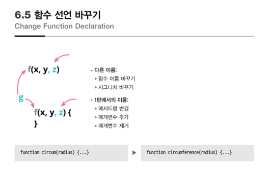
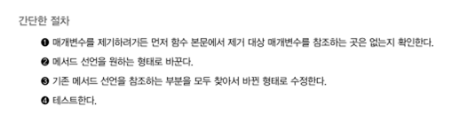
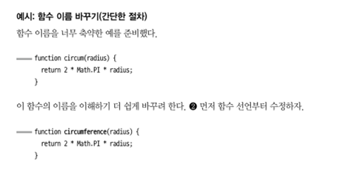
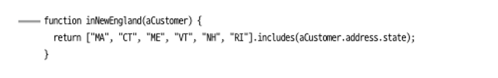
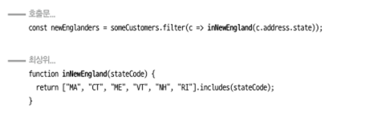

# 6.5 함수 선언 바꾸기



### 함수를 형태를 변경하면 그것이 함수 선언 바꾸기



### 함수의 이름을 바꾸는 경우



#### 마이그레이션 절차가 나오는데 IDE 의 리팩토링 기능 사용하거나 사용하는 곳이 많지 않다면 사실 필요 없을듯

#### xquare 예시
```Java
investment.delete(memberId);
```
```Java
investment.cancel(memberId);
```
#### delete 함수의 이름을 명시적으로 cancel 로 변경

### 매개 변수를 추가하는 경우


#### xquare 예시
#### 약간은 다르지만 최대한 비슷한 예제
```Java
String getBearerToken(String email, String password) {
    ... 생략
}
```
```Java
String getBearerToken() throws Exception {
    return getBearerToken("test@energyx.co.kr", "1234");
}
```


### 매개변수를 속성으로 추가하는 경우




#### 개인적으로는 customer 객체에서 행위형태로 리팩토링 하는게 좋아보임

```JavaScript
class Customer {
    address;
    
    constructor(address) {
        this.address = address;
    }

    inNewEngland() {
        return ["MA","CT","ME","VI","NH","RI"].includes(address.state);   
    };
}

someCustomers.filter(c => c.inNewEngland());

```